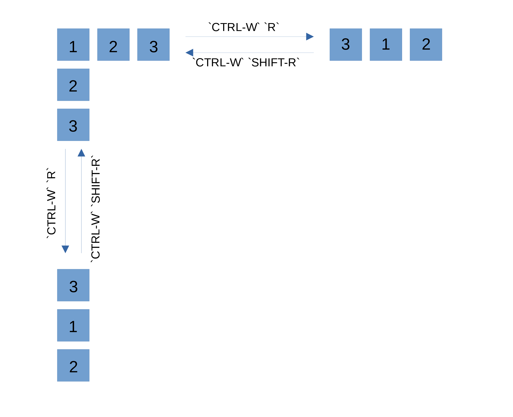

# 10 Multiple Windows in Vim
## 10.1 Initiating Multiwindow Editing
Open files with horizontally split windows. 

```bash
$ vim -o[n] file1 [file2] [file3] [...]
```

If the optional *n* is provided, Vim will create *n* of windows. If Vim cannot
split the screen into enough windows, the first files provided as aguments will
get the windows, while the remaining files are loaded into buffers not visible.

The `laststatus` option controls when the last window will have a status line,
it takes a integer value from '0' to '2': 
- '0'--never
- '1'--only if there are multiple windows
- '2'--always.

`winheight` and `winwidth` options define the minimal window size of the
**current** window. In practice, that means, the current window would expand to
the specified value of `winheight` and `winwidth` if its original size is
smaller than the values.

## 10.2 Opening Windows
The `:split` and `:vsplit` command:

```
:[n]split [++opt] [+cmd] [file]
:[n]vsplit [++opt] [+cmd] [file]
```

`:split` command opens a new horizontally split window while `:vsplit` opens a
vertically split window. The optional arguments has the following purpose:
- *n*: Tells Vim how many lines the new window displays.
- *opt*: Passes Vim option information to the new window. Must be preceeded by
  two plus sign.
- *cmd*: The command to execute in the new window. Must be preceeded by a plus
  sign.
- *file*: The file to open in the new window. If this omited, Vim will open the
  currently editing file in the new window.

> The `equalalways` option causes Vim to always create split windows in the same
> size. Add `eadirection` option and assign it a value of `hor`, `ver`, or
> `both` (horizontal, vertical, or both) to control which direction splits
> equally.

In addition to `:split`, the `:new` command (with its sibling `:vnew`) also
opens a new split window, it also takes the same arguments as `:split` does. The
difference is that `:new` automatically execute `WinLeave`, `WinEnter`,
`BufLeave`, and `BufEnter`. 

Following are two horizontal split commands without vertical sibling:

```
" opens the split window in read-only mode
:sview filename

" works like ':split', except that if 'filename' does not exist, Vim will not
" split the window.
:sfind [++opt] [+cmd] filename
```

## 10.3 Moving Around Windows
- `CTRL-W CTRL-W`: Cycle through all the windows.
- `CTRL-W j`: Move to the window below the current one.
- `CTRL-W k`: Move to the window above the current one.
- `CTRL-W h`: Move to the left window.
- `CTRL-W l`: Move to the right window.
- `CTRL-W t`: Move to the top left window.
- `CTRL-W b`: Move to the bottom right window.
- `CTRL-W p`: Move to the previous accessed window.

## 10.4 Moving Windows Around
There are two ways to change the disposition of windows:
- Swaping windows.
- Change the actual window layout.

### Rotate or Exchange
This approch **only** operate on the row or column in which the current window
lives. The following diagram is a demonstration of *rotate* command:


`[n] CTRL-W x` exchanges two windows in a row or column, the optional *n*
makes Vim to exchange the current window with the *n*th next window.

### Moving Windows and Changing Their Layout
- `CTRL-W SHIFT-K`: Move the current window to the top.
- `CTRL-W SHIFT-J`: Move the current window to the bottom.
- `CTRL-W SHIFT-H`: Move the current window to the left most of the screen.
- `CTRL-W SHIFT-L`: Move the current window to the right most of the screen.
- `CTRL-W SHIFT-T`: Move the current window to a new tab.

## 10.5 Resizing Windows
Window resizing commands:
- `CTRL-W =`: Try to resize all windows to equal size.
- `CTRL-W -` or `:resize -1`: Decrease the current window height by 1 line.
- `CTRL-W +` or `:resize +1`: Increase the current window height by 1 line.
- `CTRL-W <` or `:vertical resize -1`: Shrink the current window width by one
  column.
- `CTRL-W >` or `:vertical resize +1`: Expand the current window width by one
  column.
- `zn` or `:resize n`: Set the height of the current window to *n* lines.

`winminwidth` and `winminheight` decides the minimal width and height of
windows, respectively. This is a strict value, windows will never be allowed to
get smaller than these values.

Key mapping tips:
```
map _ :resize -1<cr>
map + :resize +1<cr>
map <Backspace> :vertical resize -1<cr>
map <Space> :vertical resize +1<cr>
```

## 10.6 Buffers and Their Interaction With Windows
The following 3 commands can be used to list all the buffers in the current Vim
session: `:ls`, `:files`, and `:buffers`. Appending a exclamation point to these
commands causes Vim to show additional informantion of buffers.

Status flags describing buffers:
- *u*: Unlisted buffers, these buffers is not listed unless you use the `!`
  modifier.
- *%* or *#*: The current and alternate buffer.
- *-* or *=*: Read-only and unmodifiable (meaning you cannot save the buffer
  even when you use a !), respectively.
- *+* or *x*: *+* indicates a modified buffer, and *x* is a buffer with read
  errors.

The hidden buffers are the ones not displayed in any window.

Buffer commands
- `:windo cmd`: Execute *cmd* on all visible windows in the current tab. Stops
  at any window where *cmd* generates an error. *cmd* is not allowed to delete,
  add, or change the order of the windows.
- `:bufdo cmd`: execute *cmd* on all buffers, and stops at the first buffer
  where *cmd* encounters an error.
- `:badd file`: Add file to buffer list.
- `bunload[!] [n]`: Unload the current buffer from the memory. The ! modifier
  forces a modified buffer to be unloaded without being saved. Unload buffer *n*
  if *n* is provided.
- `:bdelete[!] [n]`: Does the same thing as `:bunload`, but also delete the
  buffer from list.
- `:buffer n`: Move to buffer *n*.
- `:sbuffer n`: Opens a new window for buffer *n*.

## 10.7 Playing Tag With Windows
- `:stag[!] tag`: Splits the window to display the location for the *tag* found.
- `CTRL-W ]`: Split current window in two. Use identifier under cursor as a tag
  and jump to it in the new upper window.
- `CTRL-W g]`: Split current window in two. Use identifier under cursor as a tag
  and perform ":tselect" on it in the new upper window.
- `CTRL-W SHIFT-F`: Split the window and edit the file under the cursor.
- `CTRL-W gf`: Open the file under the cursor in a new tab.

## 10.8 Tabbed Editing
- `:tabnew file` or `tabedit file`: Open a new tab for *file*. If *file* is
  omitted, Vim opens a tab with an empty buffer.
- `:tabclose[!] [n]`: Close the current tab or *n*th tab is *n* is provided.
- `:tabonly[!] [n]`: Keep the current tab or the *n*th tab (if *n* is provided)
  and close all the other tabs.
- `:tabprevious [n]` and `tabNext [n]`: Move to the previous tab or *n*th
  previous tab.
- `:tabnext [n]`: Next tab, compare to `:tabprevious`.
- `:tabfirst`: First tab.
- `:tabmove [+][-][n]`: Move the current tab.  
    - If all the optional parameters are absent, Vim move the current tab to
      last.
    - If *n* is provided without *+* or *-*, Vim moves the current tab after the
      *n*th tab. If *n* equal to 0, move to left most.
    - If *n* is provided with a *+* or *-*, Vim moves the current tab to *n* of
      tabs left or right, respectively.

## 10.9 Closing and Quiting Windows
- `CTRL-W q` or `CTRL-W CTRL-Q`: Works like `:quit` (or `:q` for short).
    - If `hidden` is set and the current window is the last one referencing the
      file, the window is closed and the buffer is retained and hide.
    - If `hidden` is not set and the current window is the last on referencing
      the file, and there are unsaved changes, command fails.
- `CTRL-W c` or `:close[!]`: Close the current window. the `!` modifier will
  causes Vim to abondon unsaved changes.
    - If `hidden` is set, and this is the last window referencing the file, Vim
      closes the window and the buffer is hidden.
    - If this window is on a tab and is the last window for that tab, the window
      and the tab are closed
- `CTRL-W o`, `CTRL-W CTRL-O` and `:only[!]`: Close all windows except the
  current one.
    - If `hidden` is set, all closed windows hide their buffers. otherwise,
      unsaved windows remains on the screen.
    - If ! is provided, all unsaved changes are abandoned.
    - If `autowrite` is set, Vim saves all unsaved changes before hidding the
      buffers.
- `:hide [n]`: Quits the current window or window *n* and hides the buffer if no
  other window references it.

[Previous](./Chapter-9.md) | [Contents](../Contents.md) |
[Next](./Chapter-11.md)
