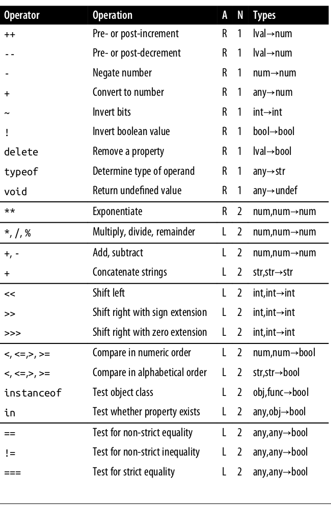
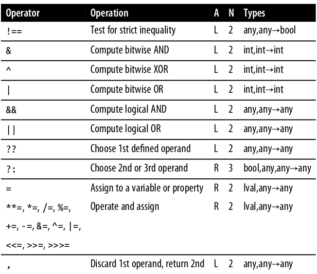

# 4 Expressions and Oprators
An expression is a phrase of JavaScript that can be *evaluated* to produce a
value. Complex expressions are built from simpler expressions.

## 4.1 Primary Expressions
Primary expressions in JavaScript are constant or literal values, certain
language keywords, and variable references.
```javascript
// Literals
1.23
"Hello"
/pattern/

// Reserved words
true
false
null
this

// References to variables, constants, or properties of global objects
i
sum
undefined
```

## Object and Array Initializers
Object and array initializers are expressions whose value is a newly created
object or array.

Undefined values can be included in an array literal by simply ommiting a value
between commas.

A single comma after the last expression in an array or Object initializer is
allowed and ignored.

Any access expression excceded the index of an array or for a property not
defined in an object are evaluated to undefined.

## 4.3 Function Definition Expressions
This kind of expression is consists of the keyword `function` followed by a
comma-separated list of zero or more identifiers enclosed between a pair of
prenthesis.
```javascript
let squre = function(x) {return x * x;};
```

## 4.4 Property Access Expression
Evaluates to the value of an object property or an array element. JavaScript
defines two types of syntax for property access.
> expression1.identifier
> expression1[expression2]

In either type of access expression *expression1* is first evaluated, if
*expression1* evaluates as `null` or `undefined`, the expression as a whole
raises a `TypeError`.

Conditional property access.
> expression1?.identifier
> expression1?.[expression2]

If expression1 evaluates to `null` or `undefined`, the entire expression
immediately evaluates to `undefined` without any further property access
attempts.

```javascript
let a;
let index = 0;
try {
    a[index++];       // TypeError
} catch(e) {
    index             // => 1: increment occurs before TypeError
}
a?.[index++];         // => undefined
index                 // => 1: not incremented
a[index++];           // TypeError
```

## 4.5 Invocation Expressions
An invocation expression is JavaScript's syntax for calling a function or
method.

When an invocation expression is evaluated, the function expression is evaluated
first. If the value of the function expression is not a function, a Type error
is thrown.

If the function has a `return` statement, then the value of the entire
invocation is the return value of the function, otherwise, the value of the
invocation expression is `undefined`.

In ES2020, you can use the notation of `?.()` to invoke a function or method. If
the expression on the left of `?.()` evaluates to `null` or `undefined`, the
value of the entire expression evaluates to `undefined` immediately. This
feature is called *conditional invocation*.

Note that `?.()` only checks if the expression on the left is `null` or
`undefined`, it does not verify that the expression is actually a function or
method.

## 4.6 Object Creation Expression
An object creation expression creats a new object, invokes a function called a
constructor to initialize the properties of the object.
```javascript
new Object();
new Point(2, 3);

// No arguments passed to the constructor function
new Object;
```

## 4.7 Operator Overview



The operators in the list are listed in precedence descend order. And operators
listed between the same lines are of the same precedence.
- A column: operator associativity, **L** left to right, __R__ right to left.
- N column: number of operands.
- Types column: types the operator expects and the result types.
- `lval`: *variables*, *properties* of objects, *elements* of arrays.
- Operators with higher precedence are performed before those with lower
  precedence.
- Property access and invocation expressions have higher precedence than any of
  the operators listed.
- NOTE that the precedence of `??` operator compare to `||` and `&&` operators,
  same thing with `**` operator compare to unary negation operators. Prenthesis
  should be used when combining these operators to explicitly prioritise the
  operation.
- JavaScript always evaluate the **sub-expressions** from left to right
  regardless of the precedence of the operators.

## 4.8 Arithmetic Expressions
Most of the arithmetic operators can work both with `BigInt` and normal numbers,
as long as you don't mix them together.

In JavaScript, all numbers are floating-point.

### 4.8.1 The `+` Operator
[Previous](Chapter-3.md) |[Contents](./Contents.md) | [Next](./Chapter-5.md)
